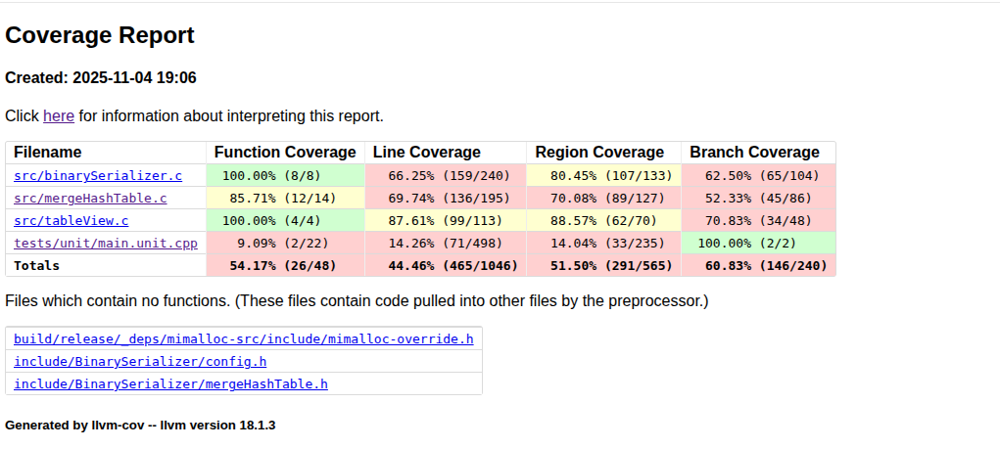

[](https://github.com/Melpomenna/BinarySerializer/actions/workflows/ci.yaml)

# BinarySerializer
Набор утилит для тестирования и API на C коде для сериализации и десиаризации данных в бинарный формат данных для OS Linux

# Поддерживается
- Операционная система Linux
- Для сборки нужен компилятор clang, gcc не тестировался

# Сборка и цели
Для сборки потребуется выполнить следующие команды:
```
make
make build
```

По умолчанию собирает release сборку
Чтобы изменить сборку с release на debug:
```
make PRESET=debug
make PRESET=debug build
```

Для запуска тестов:
```
make unit
```

Для запуска фаззингн-тестов:
```
make fuzzing
```

Для запуска бенчмарков:
```
make benchmarks
```

Чтобы установить проект в папку install:
```
make install
```
Установка в систему не поддерживается

Для сборки документации, обязательно нужно установить Doxygen:
```
make docs
```

Чтобы сразу открыть документацию можно выполнить:
```
make open-docs
```

Для проверки на cppcheck/clang-tidy:
```
make cppcheck
make clang-tidy
```

Чтобы запустить gcov и посмотреть покрытие кода (требуется llvm-profdata и llvm-cov и нужно 
выставить в CMakePresets опцию BS_ENABLE_GCOV в true):
```
make gcov
```

И сразу посмотреть отчет:
```
make open-report
```

Для запуска тестовой утилиты:
```
make test-utile
```

Для запуска perf в режиме записи (возможно нужно выполнить с sudo):
```
make perf-record
```

для просмора статистики по perf  (возможно нужно выполнить с sudo):
```
make perf-report
```

Опции которые можно изменять в CMakePresets.json:
- REL_WITH_DEBUG_INFO - сборка релиз конфигурации с дополнительно флагами на отладку
- BS_DISABLE_PERF - отключает lto
- BS_ENABLE_GCOV - добавляет флаги для покрытия кода
- BS_ENABLE_PROFILING - включает возможность запуска профилей для PGO
- BS_ENABLE_ASAN - включить ASAN
- BS_ENABLE_TEST - должны ли собираться тесты
- BS_ENABLE_BENCHMARKS - должны ли собираться бенчмарки
- BS_ENABLE_FUZZ_TEST - должны ли собираться фаззинговые тесты
- BS_ENABLE_LOG - нужно ли логировать в debug режиме
- BS_ENABLE_MI_MALLOC - использовать ли mimalloc вместо стандартного аллокатора

Опции которые можно изменять в Makefile:
- MIMALLOC_SHOW_STATS - показывать статистику от аллокатора mimalloc (нужно ключить опцию BS_ENABLE_MI_MALLOC)

- PRESET - тип сборки, поддерживает только debug/release

- FUZZ_TIME - время выполнения фаззинговых тестов
- VALGRIND_OPTIONS - опции для valgrind

# Архитектура и API

## Утилиты

Имеется 2 основных утилиты:

### ***Обработки данных***:
#### Аргументы:
- два пути до двух файлов, сформированных StoreDump;
- путь до файла результата.
#### Алгоритм работы:
- Считывает файлы (пути указаны в первых двух аргументах);
- Объединяем содержимое файлов (JoinDump);
- Сортируем содержимое (SortDump);
- Печатаем первые 10 записей в виде таблицы;
- При этом значения имеют формат:
    - id в шестнадцатеричном виде;
    - count в десятичном виде;
    - cost в научном/экспоненциальном формате c 3 знаками после запятой (123 ->
    '1.230e+2');
    - primary печатает "n" если оно 0 и "y" если оно 1;
    - mode в бинарном формате ( 5 -> '101');
- Сохраняет файл, по пути, который указан в 3 аргументе.

### ***Тестовая утилита***:
#### Алгоритм работы:
- Сформировывает файлы данных для утилиты обработки данных из массивов данных определённых в ней в качестве констант;
- Запускает утилиту обработки данных;
- Считывает результат обработки и сравнивает его с эталонными данными (константами в памяти утилиты
тестирования);
- При расхождении ожидаемого результата с полученным печатает сообщение об ошибке (в stderr);
- При успешном прохождении теста печатает отчёт о времени выполнения тестов и списке пройдённых тестов (в stdout)

Изменить или добавить набор тестовых данных можно в файле ***/cli/test/testCases.c***
Некоторые тестовые кейсы специально описаны так, чтобы они не могли проходиться (это их валидное состояние)
Для простоты не была описана сильная тестовая системы утилиты
Для проверки можно запустить unit тесты, что все сходиться


## API
- StoreDump - мапит всю возможную память, которую нужно записать и записывает поданные ей данные, файл нужно обязательно создать перед вызом StoreDump

- LoadDump - десериализация, сразу не загружает данные в память, а старается брать батчами по 64 элемента (регулируется параметро BINARYSERIALIZER_BUTCHE_SIZE в CMakePresets.json) маппить данные

- JoinDump - объединеняет 2 массива данных, данные с одинаковыми id объединятся в 1 элемент по-принципу:
    - поля count и cost должны складываться
    - поле primary должно иметь значение 0 если хотя бы в одном из элементов оно 0
    - поле mode должно иметь максимальное

- SortDump - сортировка работает на основе qsort

## Архитектура
./github/workflows - содержит конфиги для CI/CD

.vscode - для запуска задач из Visual Studio Code

/benchmarks - содержит код бенчмарков

/cli - директория содержит исходный код утилит:

    /app - содержит код утилиты обработки данных
    /test - содержит код тестовой утилиты
    /utility - содержит дополнительный функионал, нужные для утилит
   
/cmake - содержит файлы для cmake (настройка флагов компиляции и прочие возможные)

/docs - содержит Doxygen файл для сборки документации

/external - содержит дополнительные зависимости

/include - содержит публичное и приватное API

    /internal - приватное API
    /BinarySerializer - публичное API

/src содержит исходный код

/tests - содержит тесты

    /fuzzing - фаззинговые тесты, их достаточно мало (1 на текущий момент)
    /unit - unit тесты

# Документация по коду можно найти здесь
[Документация](https://melpomenna.github.io/BinarySerializer/)


# Покрытие
